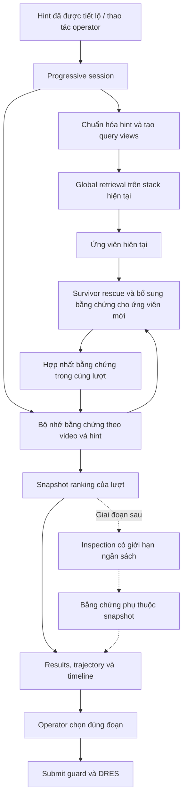

# AIC26 mở rộng cho VBS 2027: Progressive Hint Memory và truy hồi bổ sung trong video

## 1. Quyết định chiến lược và những điều cần sửa trong đánh giá ban đầu

**Chọn Progressive Hint Memory — PHM không cần huấn luyện — làm đóng góp chính**, kết hợp truy hồi toàn kho với tìm bổ sung trong các video ứng viên. Bộ nhớ phải giữ được bằng chứng qua nhiều hint, cho phép ứng viên mới vượt lên, và giúp operator kiểm tra đúng đoạn video.

Theo các lựa chọn bạn đã xác nhận:

- Nhóm nhỏ có thể thuê GPU.
- Chia thành hai giai đoạn: bản nộp tháng 9 và hệ thống hoàn chỉnh phục vụ VBS.
- Ground truth chưa được duyệt hết.
- Inspection có giới hạn ngân sách là phần mở rộng sau hạn nộp.
- Confidence có xác suất và optimal stopping chưa thuộc bản đầu.

Mục tiêu là tạo một **system paper có đóng góp rõ, hệ thống chạy thật và thực nghiệm bảo vệ được**. Không có cơ sở để bảo đảm accept hoặc gán một tỷ lệ accept đáng tin cậy.

**Yêu cầu và lịch trình đã xác minh**

| Mốc | Căn cứ để lập kế hoạch |
|---|---|
| Nộp paper | 22/09/2026, 23:59 AoE; tương đương 18:59 ngày 23/09 tại Việt Nam |
| Hoàn thành nội bộ | 22/09, trước khi bước vào ngày dự phòng |
| Notification | Trang VBS ghi 09/10; trang MMM dành cho VBS ghi 16/10 |
| Camera-ready | Các trang ghi 28/10 hoặc 01/11; chuẩn bị xong trước 28/10 |
| Thi đấu | VBS công bố 05/01/2027 |

Paper dùng **6 trang nội dung + tối đa 2 trang references, Springer LNCS**, có screenshot và mô tả tương tác. Cần theo dõi thông báo trong hệ thống nộp bài để giải quyết chênh lệch lịch. [MMM VBS CFP](https://mmm2027.net/call_for_VBS.html), [VBS Important Dates](https://videobrowsershowdown.org/call-for-papers/important-dates/), [MMM Important Dates](https://mmm2027.net/).

**Kiến trúc hiện tại đủ tốt để mở rộng trực tiếp**

Đọc code cho thấy hệ thống đã có những thành phần quan trọng:

| Thành phần hiện có | Vai trò trong hệ thống mở rộng |
|---|---|
| PE, Qwen và Milvus | Truy hồi ứng viên cho từng hint |
| OCR, speech, audio/GLAP | Bằng chứng bổ sung theo modality |
| RRF và video grouping | Nền tảng hợp nhất kết quả |
| TARA | Bằng chứng clip; thí nghiệm mở rộng sau cấu hình PHM cơ bản |
| Truy hồi có `video_id` | Primitive cho survivor rescue |
| Timeline, neighboring frames, video player | Kiểm tra vị trí đáp án |
| DRES client và submit guard | Nộp kết quả sau khi operator kiểm tra |
| Benchmark và mock tests | Nền tảng tái lập và kiểm thử |

Trong [SearchService hiện tại](/home/bao/Projects/AIC2026/backend/app/services/search_service.py:1118), `previous_hints` được chuyển xuống parser; heuristic nối history thành query. Hệ thống **chưa có bộ nhớ ứng viên qua các lượt truy hồi**.

73 test liên quan đến fusion, PE/Qwen, profile, TARA và parser đã pass trong mock mode. Đây là bằng chứng về nền tảng hiện có, chưa phải bằng chứng PHM hiệu quả hoặc dịch vụ live đang sẵn sàng.

**Bốn điều trong tài liệu đánh giá cần điều chỉnh**

1. **Novelty của PHM chưa thể đánh giá “khá–cao” chỉ từ mô tả.** Stateful retrieval, relevance feedback, RRF và in-video search đều đã có tiền lệ. Đóng góp phải được thể hiện bằng thiết kế cụ thể và đối chứng.
2. **Survivor rescue chưa được định nghĩa đủ về thang điểm.** Hạng #1 trong một video không thể được xem như hạng #1 toàn kho.
3. **Video đúng và đoạn đúng là hai bài toán khác nhau.** Bằng chứng của các hint nằm rải khắp một video chưa chứng minh được cảnh cần tìm.
4. **Không phải xây lại mọi dữ liệu V3C.** Đã có Whisper transcripts cho toàn bộ V3C1/2/3, khoảng 153 MB dữ liệu nén; cần đánh giá chất lượng và chuyển schema trước khi quyết định chạy ASR lại. V3C có khoảng 3.800 giờ, không phải 3.300 giờ như tài liệu cũ. [V3C Whisper Transcripts](https://zenodo.org/records/7383303), [VBS Data and Tools](https://videobrowsershowdown.org/about-vbs/existing-data-and-tools/).

**Định vị đóng góp so với literature**

| Công trình | Điều đã có | Hàm ý cho paper của mình |
|---|---|---|
| Robust Relevance Feedback, ICMR 2025 | Pairwise feedback, mô hình dự đoán perception và cập nhật trạng thái | PHM dùng hint được tiết lộ làm đầu vào cập nhật, không yêu cầu pairwise judgments |
| Exquisitor, CVPRW 2025 | Conversational search, relevance feedback, query reformulation | Không claim “đầu tiên dùng history hoặc hội thoại” |
| Exquisitor, VBS 2026 | Sequence-chain với RRF và in-video search | Không claim in-video search tự thân là mới |
| Query Performance Prediction, SIGIR 2023 | Dự đoán chất lượng truy hồi trong conversational search | Confidence cần nghiên cứu riêng; không suy xác suất từ rank stability |

Nguồn: [ICMR 2025](https://arxiv.org/abs/2505.15128), [Exquisitor CVPRW 2025](https://pure.itu.dk/en/publications/can-relevance-feedback-conversational-search-and-foundation-model/), [Exquisitor VBS 2026](https://pure.itu.dk/en/publications/exquisitor-atthevideo-browser-showdown-2026-temporal-queries-revi/), [QPP SIGIR 2023](https://arxiv.org/abs/2305.10923).

Đặc biệt, kết quả `10/17 → 14/17 → 16/17` trong paper ICMR không chứng minh rằng chỉ cần giữ history là đạt mức đó: hệ thống còn có feedback và mô hình đã huấn luyện. Không dùng các con số này làm đối chứng trực tiếp với PHM.

**Câu hỏi nghiên cứu chính**

> Với cùng retriever và ngân sách tương tác được kiểm soát, bộ nhớ bằng chứng theo hint và truy hồi bổ sung trong video có cải thiện thứ hạng đáp án qua các lượt so với cumulative search và fusion các hint độc lập hay không?

Đây là câu hỏi đủ hẹp để kiểm chứng trước hạn nộp, đồng thời đủ sát hệ thống VBS để làm trục paper.

## 2. Kiến trúc và thuật toán sẽ tích hợp

### 2.1. Tách ba vòng đời



Ba vòng đời có ý nghĩa riêng:

- **Session:** một mục tiêu tìm kiếm, nhiều hint.
- **Retrieval revision:** một lần tính ranking từ trạng thái hint và cấu hình xác định.
- **Inspection:** phân tích bổ sung trên một snapshot đã có.

Hint mới được phép đổi ranking. Kết quả inspection đến muộn chỉ bổ sung bằng chứng cho snapshot sở hữu nó.

### 2.2. Vị trí tích hợp và interface tối thiểu

Thêm `backend/app/progressive/` chứa kiểu dữ liệu, quản lý hint, bộ nhớ, scoring và policy rescue; thêm service orchestration riêng.

Tái sử dụng `SearchService.retrieve()` và adapter hiện có. Tránh gọi vòng qua HTTP `/api/search` cho từng hint vì response đã bị giới hạn số video và không giữ đủ thông tin trước fusion.

Bổ sung interface nội bộ:

- `RetrievalTrace`: ranked hits theo channel/model, query thực sự đã dùng, scope, trạng thái thành công/thất bại và latency.
- Truy hồi visual nhận `video_id` tùy chọn và có thể tái sử dụng query vector đã encode.
- Giữ raw score để so sánh **trong cùng model, cùng query, cùng collection**.
- Giữ rank gốc và provenance trước khi RRF/grouping làm mất thông tin.

Không thay hợp đồng trả về của `/api/search`; thêm API progressive riêng:

| API | Hành vi |
|---|---|
| `POST /api/progressive/sessions` | Tạo session với dataset, task và cấu hình truy hồi |
| `PUT /api/progressive/sessions/{id}/hints` | Nhận danh sách hint hiện hành, `expected_revision`, `client_request_id`; tính snapshot mới |
| `GET /api/progressive/sessions/{id}` | Đọc snapshot đã commit và trạng thái revision đang chạy |
| `DELETE /api/progressive/sessions/{id}` | Đóng session, vô hiệu hóa kết quả đang chạy |

Response giữ cấu trúc `groups` quen thuộc, bổ sung:

- `session_id`, `revision`, `turn`;
- hint ledger;
- rank trajectory;
- provenance của bằng chứng;
- thống kê rescue, budget, latency và trạng thái degraded.

Bản đầu dùng một backend process, state trong bộ nhớ với TTL 60 phút không hoạt động; ghi event log để replay. Khi process restart, session hết hạn rõ ràng, không giả vờ tiếp tục memory cũ. Chưa đưa Redis hoặc hệ thống hàng đợi phân tán vào đường tới hạn.

### 2.3. Hint ledger: phân biệt hint mới, lặp và chỉnh sửa

Mỗi hint lưu:

```text
hint_id
raw_text
delta_text
cumulative_text
source
revealed_at
input_mode
enabled
```

`input_mode` gồm:

- `delta`: operator nhập phần mới.
- `cumulative`: nhận mô tả tích lũy từ task.
- Việc sửa/tắt hint được biểu diễn bằng cập nhật ledger và tạo revision mới.

Quy tắc bản đầu:

1. Chuẩn hóa Unicode, khoảng trắng và dấu xuống dòng.
2. Với cumulative append rõ ràng, lấy phần bổ sung sau prefix trước.
3. Hint lặp hoàn toàn không tạo thêm phiếu bằng chứng.
4. Nếu cumulative mới thay đổi phần nội dung cũ, xử lý như sửa mô tả và replay ledger tương ứng; không đoán rằng mọi từ khác nhau đều là hint mới.
5. Không dùng fuzzy dedup mạnh có thể làm mất thay đổi quan trọng như “đỏ” thành “xanh”.
6. Tất cả query views chỉ dùng thông tin đã xuất hiện đến lượt hiện tại.

**Phạm vi query views được khóa cho bản nộp:**

- `delta`: hint mới.
- `cumulative`: toàn bộ hint đang có hiệu lực.

Selective-context rewriting bằng LLM để sau. Cách này giảm biến số, giảm latency và giúp kiểm chứng đúng đóng góp memory/rescue. Với hint chứa đại từ hoặc thiếu chủ thể, cumulative branch cung cấp đường truy hồi có ngữ cảnh.

Cumulative chỉ là một nhánh hiện tại; **không lưu cumulative của mỗi lượt thành các hint độc lập**, tránh việc H1 được bỏ phiếu lặp lại ở H2 và H3.

### 2.4. Bộ nhớ bằng chứng: video ở ngoài, vị trí thời gian ở trong

Mỗi video giữ:

- Evidence theo `hint_id`, model/channel và thời điểm phát hiện.
- Tối đa 3 frame đại diện cho mỗi hint sau temporal dedup.
- Vị trí thời gian, clip interval nếu có.
- Nguồn `global`, `rescue` hoặc `backfill`.
- Rank đã hiển thị qua từng lượt.
- Dấu hiệu evidence phân tán giữa nhiều đoạn.
- Trạng thái thiếu bằng chứng và nguyên nhân.

Cần phân biệt:

| Trạng thái | Ý nghĩa |
|---|---|
| Có trong kết quả truy hồi | Có bằng chứng tương đối từ retriever |
| Không xuất hiện trong top-K | Chưa quan sát được trong cửa sổ truy hồi |
| Channel lỗi | Không có phép đo hợp lệ |
| Operator bác bỏ | Có phản hồi trực tiếp của người dùng |

Không biến ba trạng thái cuối thành cùng một “negative evidence”.

**Giới hạn bộ nhớ:** tối đa 250 video/session. Giữ ứng viên từ lượt hiện tại và lượt trước; bảo vệ top-20 hiện tại và top-20 lượt trước, rồi cắt phần còn lại theo session score với tie-break ổn định bằng ID. Không có danh sách “đã từng top-20 thì giữ mãi”.

Snapshot lịch sử bất biến. Nếu ở H3 tìm thêm bằng chứng cho H1, ghi `discovered_at_turn=3`; không sửa lại snapshot H1 rồi báo rằng hệ thống đã biết bằng chứng đó từ lượt đầu.

### 2.5. Scoring PHM: đơn giản, cố định và không diễn giải thành xác suất

Sau fusion trong một hint, chuyển video rank sang evidence:

\[
e_i(v)=\frac{k+1}{k+r_i(v)},\qquad k=60,\ r_i(v)\ge1.
\]

Không xuất hiện trong danh sách quan sát thì dùng `e_i(v)=0` trong công thức, đồng thời giữ nhãn **unobserved**. Đây là quy ước scoring dưới truy hồi bị cắt top-K, không phải kết luận video không phù hợp.

Bộ nhớ:

\[
M_t(v)=
\exp\left[
\frac{1}{|I_t|}
\sum_{i\in I_t}
\log\bigl(\epsilon+(1-\epsilon)e_i(v)\bigr)
\right],
\qquad \epsilon=0.10.
\]

`I_t` chỉ gồm các hint độc lập có lượt truy hồi hợp lệ. Hint lặp không được tính thêm; lượt thất bại toàn bộ không tham gia phép hội tụ.

Ranking cuối:

\[
S_t(v)=0.70M_t(v)+0.30C_t(v),
\]

trong đó `C_t(v)` là evidence theo rank của cumulative branch hiện tại.

Lý do giữ cumulative branch trong ranking cuối là để ứng viên mới có đường vượt lên khi hint sau đặc biệt rõ, đồng thời hỗ trợ các hint không tự đủ ngữ cảnh.

**Các giá trị trên là preset thiết kế, chưa phải tham số tối ưu.** Bản nộp không huấn luyện ranker và không dùng test set để chọn preset đẹp nhất.

Các invariant:

- Không cộng cosine của PE với Qwen.
- Các query views của cùng hint không trở thành nhiều phiếu qua thời gian.
- Không gọi geometric score là posterior probability hoặc calibrated confidence.
- Ở H1, khi cấu hình truy hồi giống nhau và hai view trùng nhau, PHM phải giữ ranking như baseline.

### 2.6. Survivor rescue: sửa chỗ dễ tạo gain giả

Mỗi lượt sau H1:

1. Chạy global search cho delta và cumulative.
2. Chọn tối đa 8 video đứng đầu memory trước đó nhưng thiếu bằng chứng cho delta hiện tại.
3. Tìm delta bên trong từng video, lấy tối đa 3 frame/model/video.
4. Cho tối đa 4 ứng viên mới mạnh nhất quyền tìm lại bằng chứng của các hint trước.
5. Giới hạn tổng cộng 16 cặp `(video, hint)` mỗi lượt; mỗi cặp chạy trên các visual model đang bật.
6. Encode mỗi query/model một lần và tái sử dụng cho mọi filtered search.

Bước 4 là **backfill cho ứng viên mới**. Nó giảm thiên vị dành cho video xuất hiện sớm: video đúng chỉ nổi lên ở H3 vẫn có cơ hội được kiểm tra với H1/H2.

**Cách chuẩn hóa điểm rescue được chốt:**

- Hợp nhất global hits và local hits của **cùng model, cùng query**.
- Dedup bằng canonical frame ID.
- Sắp xếp chung bằng raw similarity trong chính không gian đó.
- Sau đó mới tạo rank và đi qua RRF/grouping.
- Không đưa rank nội bộ của từng local search trực tiếp vào RRF.
- Không min-max normalize độc lập trong mỗi video.
- Điểm rank sau hợp nhất được gọi là rank trong candidate pool; không giả định đó là thứ hạng chính xác trên toàn corpus.

Nếu một local hit yếu hơn mọi global hit, nó phải nằm sau các global hit đó. Nó không được nhận evidence tương đương global top-1 chỉ vì đứng đầu video được chọn.

Rescue vẫn có thể củng cố ứng viên sai; kiểm chứng bằng ablation và đối chứng ngân sách là bắt buộc. Không mô tả cơ chế này như bảo đảm cải thiện.

### 2.7. Vị trí đáp án và UI

Video card hiển thị:

- Rank hiện tại và trajectory, chẳng hạn `18 → 6 → 2`.
- Frame/clip hỗ trợ từng hint.
- Dấu `rescue` hoặc `backfill`.
- Cảnh báo bằng chứng nằm ở nhiều đoạn xa nhau.
- Link mở timeline tại đúng bằng chứng đang xem.

Bản đầu giữ temporal grouping 30 giây làm công cụ hiển thị kế thừa; không dùng nó làm định nghĩa mặc định về một cảnh đúng.

Operator chọn đoạn từ cumulative results hoặc evidence timeline. Không tự lấy frame tốt nhất của H1 làm đáp án cuối cho H3.

Chỉ hiển thị tín hiệu quan sát được:

- Top-1 có đổi không.
- Top-1 streak.
- Hint nào có bằng chứng.
- Mức trùng lặp ranking giữa hai lượt.

Có thể dùng RBO để mô tả độ ổn định của ranking, nhưng phải ghi rõ **ổn định không đồng nghĩa đúng**. [RBO, Webber et al.](https://www.codalism.com/research/papers/wmz10_tois.pdf).

Không có nhãn `93% correct`, `STRONG—submit` hoặc auto-submit trong bản nộp.

### 2.8. Tính đúng đắn khi nhiều request chạy đồng thời

Khóa sở hữu kết quả gồm `session_id + revision`; mỗi tab có session riêng.

Khi nhận request:

1. Kiểm tra revision và ghi nhận ledger mới dưới lock.
2. Chạy retrieval ngoài lock.
3. Chỉ commit nếu revision vẫn hiện hành.
4. Request cũ hoàn thành muộn không được đổi ranking, selection hoặc trạng thái loading của request mới.

Dùng request ID để retry không tạo thêm hint hay tiêu thêm budget. Frontend dùng cả abort và revision guard; abort HTTP không được xem là bằng chứng remote GPU đã ngừng tính.

Đổi task, dataset, scope hoặc cấu hình model tạo session mới. Sửa/tắt hint tạo revision mới và replay từ phần bị ảnh hưởng.

## 3. Thực nghiệm và kiểm thử để bảo vệ paper

### 3.1. Audit dữ liệu trước khi chạy bảng kết quả

[Workbook PHM hiện có](/home/bao/Projects/AIC2026/TKIS_72_queries_PHM_3_hints.xlsx) chứa:

- 72 query, đủ 3 hint/query.
- Cả 72 ghi nguồn `Synthetic rewrite từ full query`.
- 67 giá trị Video ID khác nhau.
- 60 dòng có Frame ID.
- 21 dòng có khoảng trong `start,end`.
- 12 dòng có khoảng trong `ms`.
- Nhiều dòng thiếu Query ID gốc nhưng có PHM Query ID được sinh riêng.

Các nhóm cột trên có thể chồng lấp. Chưa được xem 72 query là 72 nhiệm vụ đã kiểm chứng độc lập.

Tạo manifest đánh giá có:

```text
query_id
source_query_id
target_video_id
hint_source
hints[]
target_points / target_intervals
time_unit
annotation_status
query_temporal_type
```

Quy trình audit:

- Xem trực tiếp video để xác nhận GT và tính đúng của từng hint.
- Kiểm tra số frame là absolute frame index hay keyframe ordinal.
- Chuyển về mili giây bằng metadata/PTS; không giả định mọi video 25 fps.
- Giữ nhiều interval đáp án hợp lệ khi thực tế có nhiều đoạn.
- Tách interval rất rộng khỏi nhãn định vị chính xác.
- Dedup query cùng target hoặc nội dung tương đương.
- Phân loại `single_moment` và `multi_shot_context` trước khi xem kết quả thuật toán.
- Lưu lý do loại từng query; không loại vì baseline hoặc PHM trả sai.

Không kế thừa mặc định mẫu số 67 hay phân chia 45/22 từ benchmark cũ sang workbook mới.

### 3.2. Hai tầng dữ liệu đánh giá

**Tầng A — bản nộp: AIC synthetic progressive replay**

Dùng phần đã audit của 72 query trên toàn profile InfoShot++ phù hợp, với `scope=all`. Không giới hạn corpus vào các video chứa đáp án.

Chia theo target video: khoảng 20% nhóm làm development, phần còn lại evaluation; dùng seed cố định. Mọi query cùng target, mọi prefix và paraphrase thuộc cùng split.

Giữ preset thuật toán đã nêu. Development dùng kiểm tra pipeline và lỗi triển khai; nếu có điều chỉnh phương pháp, phải khóa trước khi chạy evaluation.

Paper gọi đúng tên: **synthetic progressive descriptions derived from existing queries**. Không gọi đây là log reveal thật hoặc user study.

**Tầng B — giai đoạn mở rộng: hint VBS thật**

Đã đọc trực tiếp archive và xác nhận:

- 63 task textual 2019–2024, mỗi task có 3 cumulative hints và GT temporal range.
- Archive 2026 có thêm 11 template KIST với 3 hint và lịch reveal.

Đây là nguồn tốt hơn cho kiểm tra tính tổng quát sau khi có index corpus tương ứng. Phải dedup giữa các năm trước khi cộng số task. [VBS textual archive](https://raw.githubusercontent.com/lucaro/VBS-Archive/main/aggregated/VBS_TextualQueries_19-24.json), [VBS 2026 archive](https://github.com/lucaro/VBS-Archive/blob/main/2026/VBS2026_run_filtered.json).

### 3.3. Baseline và ablation

Chạy cấu hình PE-only trước, sau đó PE+Qwen. Mọi phương pháp trong cùng bảng dùng cùng index, query text, preprocessing, scope và trạng thái dịch.

| Phương pháp | Mục đích |
|---|---|
| Cumulative | Baseline hiện tại |
| Latest delta | Đo giá trị của history |
| Hint-RRF | Kiểm tra PHM có hơn fusion các hint độc lập |
| PHM không rescue/backfill | Đo riêng memory và cumulative branch |
| PHM đầy đủ | Phương pháp đề xuất |
| PHM với arithmetic mean | Kiểm tra geometric aggregation có cần thiết |
| Cumulative truy hồi sâu hơn | Đối chứng lợi ích do tăng ngân sách truy hồi |

Cấu hình chính:

- Global depth: 200 hits/model/view.
- Reranker tắt.
- Query expansion tắt.
- TARA tắt trong bảng thuật toán chính.
- Dịch query được chuẩn bị và khóa một lần nếu cần, dùng giống nhau giữa các phương pháp.

Bảng hệ thống bổ sung so sánh Cumulative, Hint-RRF và PHM trên hybrid retrieval đang có OCR/ASR/audio. TARA chỉ được thêm trong thí nghiệm riêng trên phần corpus có coverage tương ứng.

**Kiểm soát chi phí:** trên development, chọn độ sâu cumulative trong `{200, 400, 800, 1000}` gần nhất với median latency của PHM, rồi khóa trước evaluation. Báo cả latency, số query vector, số lần gọi index và số frame được xử lý; không gọi hai hệ thống “cùng ngân sách” chỉ vì cùng top-K hiển thị.

Nếu giới hạn API khiến không thể khớp chi phí, trình bày đường đánh đổi chất lượng–latency và ghi rõ chênh lệch.

### 3.4. Metric và cách diễn giải

**Metric chính:** mean prefix video MRR, trung bình theo query trước rồi mới gộp toàn tập.

**Metric bổ sung:**

| Metric | Điều nó chứng minh |
|---|---|
| Video Hit@1/5/10 từng hint | Khả năng tìm đúng video |
| Moment Hit@K trên danh sách moment thực sự hiển thị | Khả năng đưa đúng vị trí lên UI |
| First-correct turn | Lượt đầu tiên đáp án đứng đầu |
| Stable-correct turn | Lượt sớm nhất đứng đầu và giữ đến cuối |
| Rescue recovery | Số trường hợp đáp án được khôi phục |
| Harmful rescue | Số trường hợp rescue làm thứ hạng đáp án xấu đi |
| Top-1 churn | Độ biến động ranking |
| Latency p50/p95 và timeout rate | Khả năng dùng tương tác |

`Stable-correct turn` dùng thông tin các lượt sau nên chỉ là metric phân tích hậu nghiệm. Không dùng nó như policy online.

Không có reveal timestamps thật thì báo **turn**, không báo “tiết kiệm X giây”. Query chưa thành công phải được tính là chưa giải, không bỏ khỏi trung bình để làm đẹp kết quả.

Với GT chỉ có điểm frame, báo kết quả theo các tolerance đã công bố và gọi đó là proxy localization. Với GT interval, dùng điểm moment được hệ thống chọn có nằm trong interval hay không. Không chấm video đúng thành moment đúng bằng cách quét vô hạn mọi frame bên trong video.

Dùng paired bootstrap 10.000 lần ở cấp target-video group để báo khoảng tin cậy cho chênh lệch. Không xem `72 × 3` prefix là 216 query độc lập.

### 3.5. Tái lập và chống leakage

Mỗi run lưu:

- Commit code và manifest dataset/index.
- Model/revision, cấu hình dịch và parser thực sự chạy.
- Hint ledger và thông tin đã có tại từng lượt.
- Raw retrieval trace, rescue requests và latency.
- Cấu hình thuật toán, seed và split.
- Trạng thái fallback, lỗi model và query bị loại.

Cache theo request cụ thể, không dùng candidate pool của H3 để đánh giá H1. Candidate rescue của phương pháp này cũng không được tự động cung cấp miễn phí cho baseline khác.

Các run benchmark cũ đã có trường hợp bật LLM nhưng thực tế fallback heuristic; bản mới phải ghi **effective configuration**, không chỉ cấu hình được yêu cầu.

### 3.6. Kiểm thử bắt buộc

| Nhóm | Tình huống cần pass |
|---|---|
| Hint | Delta/cumulative tương đương; hint lặp không đổi memory; chỉnh sửa không giữ bằng chứng đã vô hiệu |
| Thời gian reveal | Hint tương lai chưa xuất hiện trong parser, encoder, cache key hoặc log truy hồi |
| Scoring | H1 tương đương baseline; local #1 không thành global #1; không cộng score khác model |
| Memory | Ứng viên mới có thể vượt lên; eviction có giới hạn; backfill không sửa lịch sử |
| Failure | Một channel lỗi không xóa memory; toàn lượt lỗi giữ snapshot trước |
| Concurrency | H2 trả sau H3 không ghi đè; hai tab không dùng chung memory |
| UI | Selection bám theo ID khi ranking đổi; timeline và submit preview cùng một moment |
| Dataset | ID có số 0 đầu; time unit đúng; đổi profile không tái sử dụng cache sai |
| Replay | Online và replay cho cùng snapshot khi nhận cùng event trace |

Đối với DRES, [hàm `task_hint()` hiện tại](/home/bao/Projects/AIC2026/backend/app/services/submit_service.py:419) nối các text element và cache theo task. Cần giữ sequence nguyên bản, tính phần được phép thấy theo thời gian task và lọc trước khi cung cấp cho PHM. Chưa xác minh server live trả hint theo cách nào thì dùng thao tác nhập hint đã công bố của operator làm đường mặc định.

## 4. Lộ trình thực hiện và thích ứng VBS

### 4.1. Từ hiện tại đến hạn nộp

Chia thành ba luồng trách nhiệm; nếu chỉ có hai người, gộp UI/paper với người phụ trách benchmark sau khi khóa dữ liệu.

| Thời gian | Backend/thuật toán | Dữ liệu/thực nghiệm | UI/paper |
|---|---|---|---|
| 0–6 giờ đầu | Thêm retrieval trace, pure PHM core | Audit workbook, chuẩn hóa GT, khóa split | Dựng LNCS, chốt câu hỏi nghiên cứu |
| 6–18 giờ | Session API, global memory, rescue/backfill | Chạy development và baseline | Hint ledger, trajectory, provenance |
| 18–30 giờ | Test concurrency, failure, integration | Chạy evaluation khóa sẵn và latency | Screenshot từ phiên chạy thật; viết method |
| 30–42 giờ | Sửa lỗi có ảnh hưởng trực tiếp | Xuất bảng/figure và kiểm tra denominator | Viết results, limitation, related work |
| Thời gian còn lại | Đóng băng code | Kiểm tra trace của từng con số | Kiểm tra PDF và hoàn tất submission |

**Điều kiện để giữ claim cải thiện trong paper:**

- Prototype chạy end-to-end.
- Có đối chứng cumulative và Hint-RRF.
- Có ablation rescue.
- Có kết quả trên evaluation đã khóa.
- Có screenshot thật của feature được mô tả.

Nếu kết quả không cho thấy PHM tốt hơn, vẫn báo đúng kết quả và giới hạn; không tiếp tục điều chỉnh trên evaluation để lấy gain. Nếu PHM chưa chạy hoàn chỉnh, bản nộp phải thu hẹp về hệ thống đã triển khai, không trình bày PHM như kết quả đạt được.

**Không đưa vào đường tới hạn:**

- Full V3C indexing.
- Learned confidence.
- Agent tự quyết định gọi tool.
- Caption toàn corpus.
- OD/canvas mới.
- Inspection controller hoàn chỉnh.
- Thí nghiệm nhiều VLM/reranker.

### 4.2. Sau submission đến camera-ready

**Ưu tiên 1 — kiểm tra trên dữ liệu VBS thật**

- Tạo adapter V3C và ingest metadata/MSB.
- Nếu full corpus chưa sẵn sàng, dùng pilot gồm target videos của bộ query đã chọn và 1.000 distractor videos lấy mẫu cố định.
- Công bố rõ đó là subset evaluation; không suy kết quả thành full V3C.
- Sau pilot, chạy lại trên ít nhất toàn V3C1 với các query có target thuộc shard này.
- Giữ VBS 2026 làm tập external evaluation sau khi đã khóa phương pháp trên dữ liệu cũ.

**Ưu tiên 2 — operator study có kiểm soát**

Mục tiêu sau submission: 6–8 người, 12–16 task/người, hai điều kiện cumulative và PHM; cân bằng thứ tự và độ khó. Một người không làm cùng target ở cả hai điều kiện để giảm hiệu ứng nhớ đáp án.

Đo:

- Task success.
- Thời gian đến submission đúng.
- Số submission sai.
- Số lần mở video và đổi query.
- Đánh giá ngắn về mức dễ hiểu của evidence panel.

Nếu chỉ có thành viên nhóm tham gia, gọi đúng là developer pilot; không suy rộng thành usability của mọi người dùng. Cách trình bày hint có thể ảnh hưởng đáng kể đến độ khó task, nên protocol phải cố định. [Task Presentation and Human Perception](https://arxiv.org/abs/2405.04279).

**Ưu tiên 3 — inspection giới hạn ngân sách**

Dùng NVILA hiện có trên candidate được chọn; bổ sung vào panel của snapshot tương ứng.

Work/cache identity phải chứa:

```text
dataset/media revision
candidate frame hoặc interval
query/hint digest
worker/model revision
prompt/schema revision
crop/preprocessing
```

Chỉ key theo frame là chưa đủ với analysis phụ thuộc query.

Giới hạn hai tài nguyên riêng:

- Số work item được admit cho operator.
- Số remote call/compute thực sự phát sinh.

Cache hit có thể chiếm một slot inspection nhưng không tính thành GPU call. Kết quả stale không thay đổi ranking; timeout không làm mất baseline.

### 4.3. Adapter dataset: tránh mang giả định AIC sang V3C

Tạo `DatasetProfile` có capability và nguồn metadata rõ ràng, thay những kiểm tra như “Qwen chỉ được dùng nếu `is_infoshotpp`” bằng kiểm tra collection/model thực sự có trong profile.

Các thay đổi cần thiết:

| Khía cạnh | Quyết định |
|---|---|
| Identity | ID nội bộ gồm dataset + video + shot/frame; giữ `00047` dưới dạng string |
| Media URL | Builder theo profile hoặc manifest, không suy đường dẫn từ prefix AIC |
| Temporal mapping | MSB/PTS làm nguồn thời gian; tách shot ordinal khỏi absolute frame |
| Scope | V3C mặc định toàn corpus; shard/category là facet tùy chọn |
| Ngôn ngữ | Query tiếng Anh không đi qua VI→EN; thêm fallback parser tiếng Anh |
| Capabilities | Công bố coverage từng model/channel, không chỉ cờ có endpoint |
| Submission | `mediaItemName` lấy từ registry chính thức; kiểm tra task type và đơn vị ms |

Không tự động coi toàn bộ MSB shot là khoảng đáp án đúng. MSB hỗ trợ điều hướng; khoảng hoặc thời điểm nộp vẫn phải theo semantics của task DRES. Bản đầu V3C ưu tiên moment operator chọn, không dùng mặc định padding của AIC.

### 4.4. Dữ liệu và compute cho bản thi đấu

Thứ tự ingest:

1. Video/shot registry và media manifest.
2. Title, description, tags vào metadata retrieval.
3. Whisper transcripts đã công bố.
4. PE trên toàn bộ keyframe chính thức.
5. Qwen sau khi đo lợi ích/chi phí trên pilot.
6. OCR bổ sung, rồi mới cân nhắc TARA/audio/OD theo lỗi thực nghiệm.

Metadata Vimeo là kênh context cấp video; không coi một title/tag là bằng chứng rằng mọi shot trong video đều khớp query.

Trước khi thuê GPU dài hạn, chạy pilot 10.000 keyframe đại diện để đo:

- Throughput gồm decode và I/O.
- GPU memory theo batch size.
- Tỷ lệ lỗi và thời gian retry.
- Kích thước vector/index và chi phí load.

Với khoảng 4,14 triệu shot, riêng vector FP32 có dung lượng xấp xỉ:

- PE 1280 chiều: **21,2 GB**.
- Qwen 4096 chiều: **67,9 GB**.

Đây chỉ là phép tính raw vectors, chưa có index, metadata, replica và dự phòng. Không dùng throughput ước lượng trong tài liệu cũ làm cam kết lịch hoàn thành.

VBS 2027 còn dùng MVK và GynSurg; adapter nên hỗ trợ cả hai. Phần lớn công sức dữ liệu dành cho V3C, nhưng trước thi đấu cần media registry, visual search và submission path cho các collection còn lại. [VBS 2027 CFP](https://videobrowsershowdown.org/call-for-papers/).

### 4.5. Task coverage trước tháng 1

| Task | Hướng triển khai |
|---|---|
| KIST | PHM cho hint được tiết lộ theo thời gian |
| KISC | Nhập phát biểu/hint của panel vào ledger; chỉ claim hội thoại chủ động khi đã tích hợp và kiểm chứng |
| VQA | Candidate retrieval + NVILA + evidence + operator xác nhận |
| AVS | Shot selection, dedup, trạng thái đã nộp và queue do operator duyệt |
| KISV | Tái sử dụng image search/browser; không ưu tiên OD mới |

Bộ sinh 100 đáp án AIC có thể tái sử dụng temporal dedup và candidate diversification cho AVS. **Không dùng nguyên objective AIC hoặc tự động nộp hàng trăm đáp án** rồi xem đó là AVS support.

Bổ sung interaction logging và đối chiếu OpenAPI của DRES triển khai thực tế, không chỉ kiểm tra endpoint submit. [DRES communication](https://videobrowsershowdown.org/about-vbs/communication-with-dres/).

Mốc vận hành nội bộ:

- **Trước 28/10:** external replay, pilot UI và bản camera-ready sẵn sàng.
- **Tháng 11:** baseline PE và text channels trên các collection đã cam kết hỗ trợ.
- **Trước 15/12:** hoàn thành task workflows và DRES rehearsal.
- **15–22/12:** kiểm tra nhiều operator, mất worker, reconnect và media seek.
- **Sau 22/12:** đóng băng tính năng, chỉ sửa lỗi phục vụ thi đấu.

## 5. Cấu trúc paper, sản phẩm bàn giao và tiêu chí hoàn thành

**Tên paper làm việc:**

> **AIC26 at VBS 2027: Progressive Hint Memory for Interactive Video Search**

Phân bổ 6 trang nội dung:

| Phần | Ngân sách dự kiến |
|---|---:|
| Problem, motivation và related work | 0,8 trang |
| Hệ thống hiện tại và kiến trúc mở rộng | 0,9 trang |
| PHM, rescue và scoring | 1,4 trang |
| Interactive workflow với screenshot | 0,8 trang |
| Evaluation, ablation và latency | 1,6 trang |
| Limitations và deployment status | 0,5 trang |

Ba đóng góp được trình bày:

1. Bộ nhớ bằng chứng cho mô tả được tiết lộ dần, không cần huấn luyện thêm mô hình theo task.
2. Truy hồi bổ sung có giới hạn cho ứng viên cũ và ứng viên mới, với provenance và hợp nhất điểm nhất quán.
3. Tích hợp vào hệ thống tương tác, kèm replay/ablation đánh giá thứ hạng và chi phí.

RRF, geometric mean, caching, revision IDs và model pretrained được ghi nhận là thành phần kế thừa. Không trình bày chúng riêng lẻ như phát minh mới.

**Artifact cần bàn giao**

- Prototype PHM chạy trong console hiện tại.
- Hint/GT manifest đã audit và split cố định.
- Script replay online-equivalent.
- Raw trace, configuration và bảng kết quả sinh tự động.
- Architecture figure, screenshot thật và demo ngắn.
- Source LNCS cùng tài liệu tái lập.
- Bảng trạng thái `implemented / evaluated / planned` cho các module.

**Tiêu chí hoàn thành bản nộp**

- Người đọc nhìn screenshot hiểu được hint mới thay đổi bằng chứng như thế nào.
- Mọi con số truy được về run và tập query cụ thể.
- Memory/rescue được so với cả cumulative và Hint-RRF.
- Gain, nếu có, được đặt cạnh chi phí thêm và khoảng bất định.
- Video-level và moment-level effectiveness được báo riêng.
- Synthetic hints được ghi nhãn đúng.
- Không sử dụng hint tương lai hoặc candidate pool từ lượt tương lai.
- Phần V3C chưa chạy được trình bày đúng là kế hoạch triển khai.
- Abstract và conclusion chỉ khẳng định những gì thực nghiệm thực sự hỗ trợ.

Giả định cuối cùng của kế hoạch: index AIC và encoder hiện có có thể được nhóm vận hành để chạy live benchmark; điều này phải được xác nhận trong sáu giờ đầu. **Rủi ro lớn nhất hiện tại là chất lượng nhãn, tính công bằng của đối chứng và thời gian hoàn thiện prototype — vì vậy ba việc đó được ưu tiên trước mở rộng số lượng model.**
