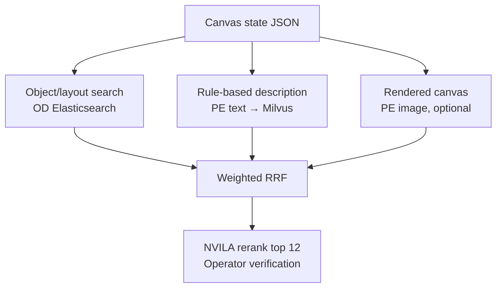

> From: https://chatgpt.com/c/6a6f18a5-c294-83ec-a3bd-d969a4cd0e8d

# you asked

message time: 2026-08-02 17:20:31

xem những file này để hiểu rõ pipeline hiện tại của tui cho cuộc thi aic. Sau đó giúp tui nghiên cứu xem liệu có thể tận dụng object detection cho 1 tính năng mà tui nghĩ ra cho task vkis là sẽ có một bảng vẽ thì user có thể tự do vẽ vào đó, có thể lựa chọn màu từ bảng màu, đồng thời có sẵn các hình vẽ đại diện cho danh sách các object detection, và user có thể kéo thả vào vị trí tương ứng bên trên ảnh. Thì có thể là sau khi vẽ xong sẽ có 2 luồng (tui đang suy nghĩ không biết nên lựa chọn hướng nào cho tối ưu), thì 1 luồng là sẽ đưa bức ảnh được user vẽ đó đi so độ tương đồng với 400k keyframe được lưu trên milvus để có thể tìm ra ảnh tương ứng với video được chiếu trên màn hình lớn trong vkis, 1 luồng thì là sẽ cho bức ảnh đó sang 1 model VLM nào đó để từ đó có thể tạo ra text query tương ứng với bức ảnh đó và đem đi search. Đó là tính năng mà tui có thể nghĩ ra cho task vkis hiện tại, hay bạn có đề xuất nào khác để phục vụ riêng cho task vkis mà không cần tạo thêm model mới, process lại data, mà tận dụng những metadata hiện có hay không

---

# chatgpt response

Tui sẽ đọc toàn bộ 5 file để dựng lại đúng kiến trúc retrieval hiện tại, rồi mới đánh giá hai luồng “ảnh vẽ → embedding” và “ảnh vẽ → VLM → text” trên chính dữ liệu/metadata mà đội đang có. Vì có một tài liệu PDF, tui sẽ dùng quy trình đọc PDF để không bỏ sót bảng, sơ đồ hay chú thích; sau đó tui sẽ tra cứu các hướng gần đây bằng nguồn kỹ thuật gốc.

Tui đang đối chiếu riêng “pipeline mong muốn” với “app retrieval đã thực sự triển khai”, vì hai lớp này không hoàn toàn giống nhau. Điểm này sẽ quyết định ý tưởng nào có thể cắm thẳng vào hệ thống hiện tại và ý tưởng nào mới chỉ khả thi khi metadata/object index đã được nạp thật.

Sau khi đọc đủ tài liệu, có một khác biệt rất quan trọng: pipeline chiến lược có `object_details = {label, bbox, conf}`, nhưng app live hiện tại mới thực sự có PE trên Milvus và OCR/speech/audio/keyframe-map trên Elastic; tài liệu còn ghi rõ object/scene/action filter là “chưa làm”. Vì vậy tui sẽ đánh giá theo hai mức: dùng ngay không đụng index, và dùng lại object JSON sẵn có nhưng chỉ upload/index lại — không chạy detector hay tạo model mới.

---

# you asked

message time: 2026-08-02 17:26:22

đây là pipeline OD mà tui đang cho chạy và sẽ xong trong thời gian sắp tới

---

# chatgpt response

Kết quả nghiên cứu khá rõ: ý tưởng của ông không chỉ khả thi mà gần như trùng với một hướng từng được dùng trong Video Browser Showdown. VISIONE cho người dùng kéo-thả object/màu lên canvas, lượng tử hóa vị trí thành lưới 7×7 rồi tìm bằng chỉ mục văn bản; vitrivr cũng có “semantic sketch” theo nhãn và phân bố không gian. Điểm cần sửa trong thiết kế của mình là đừng biến canvas thành ảnh rồi làm mất phần cấu trúc mà UI vốn đã biết. Tui đang chốt kiến trúc hybrid và thứ tự ưu tiên triển khai cho đúng app hiện tại.

Oke, vậy phần quan trọng nhất còn thiếu đã có rồi. Tui sẽ đọc cả đặc tả lẫn từng cell của notebook để kiểm tra chính xác OD đang xuất những field nào — nhất là `bbox` chuẩn hóa, màu, vị trí, count, synonym và schema Elasticsearch — rồi cập nhật lại kiến trúc canvas theo những gì có thể dùng ngay khi job chạy xong.

OD v5 làm thay đổi kết luận theo hướng rất tích cực: metadata sắp có không chỉ là `label + bbox + conf`, mà đã có sẵn `bbox_norm`, 7×7 position, màu theo instance mask, count/uncertainty và cả helper `query_drawn_region`. Tức là canvas có thể trở thành một kênh truy hồi thật sự, không cần VLM đoán lại nội dung và cũng không cần encode bức vẽ làm đường chính. Tui đang kiểm tra nốt các điểm ghép với định danh của retrieval app và trường hợp nhiều object cùng loại.

Sau khi đọc kỹ [OD_Pipeline(1).md](sandbox:/workspace/scratch/5ed74c105186/upload/OD_Pipeline(1).md) và [OD_Kaggle_Notebook(4).ipynb](sandbox:/workspace/scratch/5ed74c105186/upload/OD_Kaggle_Notebook(4).ipynb), tui chốt luôn: tính năng canvas cho VKIS bây giờ khả thi hơn rất nhiều, vì OD v5 đã tạo gần như toàn bộ metadata cần thiết.

Nhưng phương án tối ưu không phải chọn một trong hai luồng ban đầu. Nên dùng luồng thứ ba làm chính:

> Canvas → structured object/layout query → Elasticsearch OD  
> đồng thời Canvas → text mô tả tự động → PE/Milvus  
> sau đó fusion và dùng NVILA kiểm tra top candidate.

## 1. OD v5 hiện đã hỗ trợ được gì?

| Yêu cầu canvas | OD v5 đã có |
|---|---|
| Object là gì | `canonical_label`, `label`, `aliases` |
| Vị trí | `bbox_norm`, `center_norm`, `position_tags`, `grid7` |
| Kích thước | `size_norm.width/height/area` |
| Màu object | `dominant_color`, `color_names`, `color_reliable` |
| Số lượng | `object_counts`, uncertainty/lower-bound |
| Vẽ bbox lên kết quả | `inner_hits` trả `bbox_norm`/`bbox_px` |
| Tìm bbox giống vùng user vẽ | `query_drawn_region()` |
| Tìm gần vị trí click | `query_near_point()` |
| Tìm object + màu + vị trí | `query_object()` |
| Elasticsearch an toàn | `detections` và `object_counts` đều là `nested` |

Ý tưởng này cũng đã có tiền lệ rất sát trong VBS: VISIONE cho người dùng kéo object/màu lên canvas, chia không gian thành lưới 7×7 rồi tìm theo object, màu và vị trí. Hệ thống còn dùng Elasticsearch/Lucene-style full-text retrieval để mở rộng quy mô. [VISIONE paper](https://iris.cnr.it/retrieve/79a64f37-ccf9-49ab-b795-73313aeefce4/prod_456298-doc_176552.pdf) Một hướng khác, “Query by Semantic Sketch”, cũng truy hồi ảnh/video từ nhãn semantic và phân bố không gian của chúng. [Query by Semantic Sketch](https://arxiv.org/abs/1909.12526)

OD v5 của ông còn mạnh hơn thiết kế VISIONE cũ ở chỗ có bbox liên tục, instance mask, màu theo object và geometry ranking thay vì chỉ dựa vào cell token.

## 2. Kiến trúc tui khuyên dùng



Điểm quan trọng nhất: dữ liệu gốc của query phải là JSON của canvas, không phải ảnh PNG đã render.

Ví dụ:

```json
{
  "objects": [
    {
      "id": "q1",
      "label": "car",
      "bbox": [0.05, 0.52, 0.35, 0.86],
      "color": "red",
      "required": true
    },
    {
      "id": "q2",
      "label": "person",
      "bbox": [0.66, 0.35, 0.82, 0.86],
      "color": "blue",
      "required": true
    }
  ],
  "relations": [
    {"subject": "q1", "relation": "left_of", "object": "q2"}
  ],
  "action_text": "the person is standing beside the car",
  "ocr_hint": ""
}
```

Frontend đã biết chính xác object nào được kéo, màu gì, bbox ở đâu. Không có lý do gì render thành ảnh rồi bắt VLM “đoán ngược” lại những thông tin này.

## 3. So sánh ba luồng

| Luồng | Đánh giá |
|---|---|
| Canvas raster → PE image → Milvus | Làm được, nhưng chỉ nên là kênh phụ |
| Canvas raster → VLM → text → search | Tốt hơn luồng trên, nhưng vẫn làm mất thông tin và có hallucination |
| Canvas JSON → OD spatial search + PE text | Nên là luồng chính |

### Canvas raster → PE image

Kỹ thuật thì làm được. PE-Core-G14-448 là CLIP-style model có cả image và text encoder trong cùng không gian, nên chỉ cần thêm `/encode-image` vào server hiện tại rồi search collection `aic26_image_peg14_v1`. [Meta Perception Encoder](https://github.com/facebookresearch/perception_models)

Nhưng có ba vấn đề:

- Icon/cartoon/freehand sketch khác phân phối rất xa ảnh thật.
- Global embedding thường không giữ vị trí object đủ chính xác.
- Kết quả dễ bị ảnh hưởng bởi style icon, nền canvas và nét vẽ của từng người.

Các nghiên cứu sketch-photo retrieval thường phải thêm prompt learning hoặc cơ chế thu hẹp modality gap; điều này cho thấy raw CLIP-like embedding không nên được xem là kênh đáng tin tuyệt đối. [CLIP for Zero-Shot SBIR](https://arxiv.org/abs/2303.13440), [Modality-Aware ZS-SBIR](https://arxiv.org/abs/2401.04860)

Vì vậy, có thể thử với weight RRF thấp, chẳng hạn `0.15–0.25`, rồi chỉ giữ nếu benchmark thật cho thấy Recall@K tăng.

### Canvas → VLM → text

Nếu bắt buộc chọn giữa hai luồng ban đầu, tui chọn luồng này. Nhưng nên bỏ VLM ở bước cơ bản.

Có thể chuyển JSON thành câu trực tiếp:

> “A red car occupies the lower-left area. A person wearing blue stands on the right of the car.”

Cách này:

- gần như 0 ms;
- không hallucinate;
- không mất object/count/position;
- dùng ngay `/encode-text`;
- có thể tạo 2–3 biến thể rồi dùng max-cosine như query expansion hiện tại.

PE-G14 có context text hữu hạn, nên câu cần ngắn và ưu tiên object, màu, action, quan hệ. Có thể tạo riêng:

1. Scene query.
2. Object-layout query.
3. Action/attribute query.

VLM chỉ nên dùng khi user vẽ freehand không gắn semantic hoặc nhập một mô tả rất mơ hồ.

## 4. Cách tìm nhiều object trên canvas

Notebook hiện có `query_drawn_region()`, nhưng helper này đang xử lý một object mỗi lần. Canvas cần thêm một tầng `query_canvas()` ở backend.

Không nên chỉ tạo nhiều nested query rồi `must` tất cả, đặc biệt khi có hai object cùng class. Ví dụ user đặt hai người, hai nested clause có thể cùng match một detection `person`.

Phương án đúng:

1. Elasticsearch lấy candidate rộng bằng:

   - danh sách canonical label;
   - count mềm;
   - vị trí/bbox tương đối;
   - màu reliable;
   - `minimum_should_match`, không bắt buộc tất cả.

2. Lấy khoảng top 300–500 frame cùng toàn bộ detection cần thiết.

3. Backend thực hiện one-to-one assignment giữa object user đặt và detection bằng Hungarian matching.

Một pair object–detection có thể được chấm theo:

- label/confidence;
- khoảng cách tâm;
- độ giống kích thước và tỉ lệ cạnh;
- màu;
- quan hệ với các object khác.

Đối với VKIS, tui sẽ giảm trọng số IoU so với helper hiện tại. Người dùng đang vẽ lại từ trí nhớ, không thể đặt bbox chính xác như ground truth. Relative relation như `left_of`, `above`, `overlap`, `near` thường ổn định hơn IoU tuyệt đối. STAR Retrieval cũng biểu diễn object và quan hệ không gian thành graph, đồng thời dùng discretization để tránh matching quá cứng. [STAR Retrieval](https://www.vldb.org/pvldb/vol15/p3226-yu.pdf)

Nên có hai chế độ:

- `Rough`: ưu tiên label, center và relative relation.
- `Precise`: tăng trọng số IoU, size, color và count.

## 5. Màu sắc dùng được đến đâu?

OD v5 đã xử lý khá tốt:

- palette 16 màu;
- CIE Lab;
- instance segmentation mask;
- vùng thân người để ước lượng màu quần áo;
- `color_reliable`;
- top 3 màu và purity/entropy.

Do đó UI nên dùng đúng 16 màu trong pipeline. Nếu muốn cho user chọn RGB tự do thì map màu đó về palette gần nhất trước khi query.

Tuy nhiên, màu hiện tại là màu gắn với object:

- xe đỏ;
- người áo xanh;
- cờ vàng;
- túi đen.

Nó chưa phải spatial color map toàn khung hình. Nếu user tô nửa trên canvas màu xanh để biểu diễn bầu trời thì OD index không có dữ liệu tương ứng. Trong phiên bản đầu:

- màu gắn vào icon/object: dùng làm query thật;
- brush tô background: chỉ đưa vào PE text hoặc PE-image experimental;
- không hard-filter background color bằng OD.

## 6. Cách dùng NVILA tốt nhất

Không nên dùng NVILA chủ yếu để chuyển canvas thành text. Hãy dùng nó sau retrieval:

```text
Structured canvas description
+ top 12 candidate keyframes
→ NVILA chấm match/partial/no
→ giải thích object nào đúng, object nào sai vị trí/màu
```

Như vậy ông tận dụng đúng NVILA-8B đã có mà không cần model mới hoặc caption lại 382K frame.

Ví dụ output:

```json
{
  "candidate_id": "C03",
  "match": "partial",
  "confidence": 0.74,
  "matched": ["red car on left", "one person on right"],
  "mismatched": ["person clothing appears black, not blue"]
}
```

Đây cũng chính là general VLM reranker mà tài liệu retrieval hiện đánh dấu là chưa triển khai, nhưng có thể tái sử dụng endpoint NVILA QA.

## 7. Những tính năng VKIS khác rất đáng làm

### Storyboard nhiều canvas

Đây là tính năng tui đánh giá mạnh nhất cho riêng VKIS.

Một clip 15–20 giây có thể chứa nhiều khoảnh khắc:

- Canvas A: người bước vào phòng.
- Canvas B: người đứng cạnh bàn.
- Canvas C: cận cảnh tài liệu.

Search từng canvas độc lập, sau đó tái sử dụng chính `TRAKE DP` để tìm các frame thuộc cùng video và tăng dần theo thời gian.

Không cần model mới, không cần process lại dữ liệu. Phần sequence assembly của ông đã có sẵn.

### “More like this frame” thực sự

Hiện feedback mới chủ yếu boost video. Với VKIS, khi operator tìm thấy một frame “gần giống”, hãy lấy chính vector PE đã lưu của frame đó làm image query và tìm hàng xóm trong Milvus.

Cái này đáng tin hơn rất nhiều so với encode ảnh vẽ, vì query và candidate đều là ảnh thật cùng domain.

Có thể morph vector:

$$
q'=\operatorname{normalize}((1-\alpha)q_{\text{text}}+\alpha v_{\text{positive}}-\beta \bar v_{\text{negative}})
$$

Không cần encode lại 382K frame.

### Object exclusion

Cho phép kéo icon vào ô `NOT PRESENT`. Tuy nhiên chỉ dùng làm soft penalty, không hard filter, vì detector có thể bỏ sót.

Đặc biệt, một class chỉ được coi là “không có” nếu class đó thật sự nằm trong vocabulary của genre tương ứng. Pipeline đang prompt theo genre, nên absence của một class chưa từng được prompt không có ý nghĩa.

### OCR hint riêng cho VKIS

Clip không có âm thanh nhưng vẫn có thể có:

- bảng hiệu;
- logo;
- biển số;
- tiêu đề bản tin;
- chữ trên áo.

Một ô `Visible text` tìm qua OCR hiện có có thể cứu nhiều câu hơn freehand drawing.

### Detection overlay trên kết quả

`inner_hits` đã trả bbox match. Frontend nên:

- vẽ bbox cùng màu với object query;
- nối object query ↔ detection match;
- hiển thị điểm position/color/conf;
- cho operator thấy tại sao frame được trả về.

Điều này giảm submit sai tốt hơn chỉ hiển thị một score tổng.

## 8. Hai điểm tích hợp phải làm cẩn thận

### Identity

OD đang dùng:

```text
document_id = video_id:frame_name
```

App retrieval dùng:

```text
submit_keyframe_id = category/video_id/frame_3_digits
```

Object adapter phải chuẩn hóa qua `backend/app/identity.py`:

```text
K01_V001:1
→ K01/K01_V001/001
```

Không dùng `r2_key` hoặc `image_url` để join.

Ngoài ra, `frame_index` trong OD hiện được lấy từ tên file keyframe. Không nên mặc định đó là raw video frame index để submit DRES; vẫn phải enrich qua `aic26_keyframe_map_v1` giống các channel hiện tại.

### Grounding DINO

Run hiện tại thực chất là YOLOE-only do Grounding DINO FP16 bị lỗi. Điều này không phá tính năng canvas, nhưng:

- recall phụ thuộc vocabulary đã prompt;
- icon palette frontend nên ưu tiên đúng canonical vocabulary đã chạy;
- class chưa có trong vocabulary nên chuyển sang PE text, không hard-filter OD.

## 9. Benchmark cần sửa

`evaluate_spatial_retrieval()` hiện dùng chính bbox ground truth làm query. Metric này hữu ích để kiểm tra engine, nhưng sẽ lạc quan hơn hành vi VKIS thật.

Nên tạo benchmark có nhiễu giống người vẽ:

- lệch tâm ±5–15%;
- scale bbox 0.6–1.5 lần;
- bỏ sót một object;
- nhầm màu gần nhau;
- count sai ±1;
- chỉ nhớ relative relation.

So sánh:

1. PE text từ canvas.
2. OD layout.
3. Canvas raster → PE image.
4. OD + PE text.
5. OD + PE text + NVILA rerank.
6. Storyboard multi-canvas.

Đo Recall@10/50/100, median rank, thời gian tìm thấy frame đúng và số submit sai.

## Thứ tự tui khuyên triển khai

1. Chờ OD hoàn tất validation và atomic alias.
2. Viết `ObjectElasticAdapter` và map đúng `submit_keyframe_id`.
3. Làm canvas semantic: object icon, bbox, 16 màu, required/optional.
4. Viết multi-object `query_canvas()` + one-to-one assignment.
5. Tạo PE text trực tiếp từ canvas JSON và fuse thành channel `object_layout`.
6. Thêm detection overlay.
7. Thêm storyboard nhiều canvas bằng TRAKE DP.
8. Thêm candidate-as-query PE.
9. Tái sử dụng NVILA để rerank top 12.
10. Cuối cùng mới A/B test canvas raster → PE image.

Tóm lại: với OD v5 này, canvas không còn là một ý tưởng phụ nữa mà có thể trở thành kênh truy hồi VKIS chính. Phần còn thiếu chủ yếu là query orchestration và UI, không phải model hay offline processing.

---

# you asked

message time: 2026-08-02 18:26:26

code dùng để upload elastic search hiện tại đã ổn chưa

---

# chatgpt response

Tui sẽ review riêng phần `od_elastic.py` theo ba lớp: mapping có tương thích đúng document v5 không, bulk upload/retry có thể tạo index thiếu hoặc sai không, và release gate/alias có thật sự ngăn index chưa hoàn chỉnh lên production không. Tui cũng sẽ đối chiếu các API đang dùng với tài liệu Elasticsearch hiện tại, vì đây là chỗ “chạy được” chưa chắc đã đồng nghĩa “release an toàn”.

Mình đã rà gần hết luồng upload. Kết luận sơ bộ: phần kiểm chứng dữ liệu trước khi đổi alias làm khá chắc; các điểm đáng lo nằm ở khả năng resume/retry và quản lý version của mapping, chứ không phải format bulk hay ID document.

Code hiện tại **ổn về tính đúng đắn và an toàn dữ liệu**, mình đánh giá khoảng **8/10**. Có thể dùng để test/staging ngay; trước khi activate alias production cho toàn bộ 382.299 keyframe, nên sửa hai điểm quan trọng.

### Phần đang làm tốt

- `_id = video_id:frame_name` deterministic, nên chạy lại không tạo document trùng.
- Bulk NDJSON đúng định dạng và có giới hạn cả số document lẫn kích thước request.
- Retry riêng các item bị `408/429/502/503/504`, không gửi lại toàn bộ batch.
- Kiểm tra SHA-256 của từng R2 shard trước khi index.
- Trước khi đổi alias, code kiểm tra:
  - `release-report.json`;
  - số shard và số document;
  - duplicate ID;
  - hash toàn bộ tập ID ở R2 và Elasticsearch;
  - marker-set hash.
- Việc remove alias cũ và add alias mới nằm trong một `_aliases` request, nên là atomic theo Elasticsearch. [Elastic Aliases](https://www.elastic.co/docs/manage-data/data-store/aliases)

### Hai điểm nên sửa trước production

1. **Thiếu version/fingerprint của Elasticsearch mapping**

Tên concrete index hiện dựa vào:

```text
config_hash + manifest_hash + runtime_hash
```

Nhưng `runtime_hash` không bao gồm `od_elastic.py`. Nếu mapping thay đổi mà ba hash trên giữ nguyên, code có thể tái sử dụng index cũ. `ensure_index()` hiện chỉ kiểm tra vài field nên chưa phát hiện hết mapping lệch.

Nên thêm:

```python
ES_SCHEMA_VERSION = "od-es-v5.1"
```

vào:

- tên concrete index;
- `mappings._meta`;
- bước kiểm tra `ensure_index()`.

Đây là điểm mình ưu tiên sửa cao nhất.

2. **Retry chưa bắt lỗi kết nối**

`_post_bulk()` retry tốt khi Elasticsearch trả HTTP status, nhưng nếu gặp:

- read timeout;
- connection reset;
- DNS/network interruption;

thì `requests.RequestException` sẽ làm dừng cả upload. Không làm sai dữ liệu, vì chạy lại vẫn idempotent, nhưng có thể mất nhiều thời gian.

Nên dùng một `requests.Session()` và retry exception với exponential backoff + jitter.

### Các cải thiện tiếp theo

- Trong lúc import lớn, đặt `refresh_interval=-1`; sau khi hoàn tất đổi lại `30s`. Elasticsearch cũng khuyến nghị để `replicas=0` khi initial load rồi khôi phục replicas sau đó. [Elastic indexing guidance](https://www.elastic.co/docs/deploy-manage/production-guidance/optimize-performance/indexing-speed)
- Hiện index production vẫn giữ `number_of_replicas=0`. Nếu cluster có từ hai data node, nên khôi phục thành `1` trước khi activate alias; nếu chỉ có một node thì giữ `0`.
- Sau khi upload và kiểm tra xong, đặt `index.blocks.write=true` trước lần scan ID cuối cùng để bảo đảm index không bị thay đổi trong khoảng kiểm chứng → đổi alias. [Elastic index blocks](https://www.elastic.co/docs/reference/elasticsearch/index-settings/index-block)
- Nếu chạy `UPLOAD=True, ACTIVATE=False`, sau đó chạy lại với `ACTIVATE=True`, code sẽ upload lại toàn bộ dữ liệu. Không sai nhưng tốn thời gian. Có thể thêm mode `VERIFY_AND_ACTIVATE_ONLY`.
- Nên kiểm tra `release-report.json` ngay đầu job nếu `ACTIVATE=True`; hiện report chỉ được kiểm tra sau khi upload xong, nên report thiếu/sai sẽ gây phí cả lượt upload.
- `number_of_shards=3` chưa phải bug, nhưng cần xem `_cat/indices` sau ingestion vì `detections` và `object_counts` là nested, số Lucene document thực tế lớn hơn 382k khá nhiều.

### Kết luận

- **GO cho staging/test upload.**
- **Conditional GO cho production alias:** sửa mapping version và network-exception retry trước.
- Không cần dừng hoặc chạy lại OD pipeline đang chạy; các sửa đổi này chỉ nằm ở uploader Elasticsearch.
- Khi release report đã pass, việc đặt đồng thời `UPLOAD_TO_ELASTIC=True` và `ACTIVATE_ELASTIC_ALIAS=True` vẫn an toàn, vì alias chỉ đổi sau toàn bộ release gate.

---
Powered by [AI Exporter](https://saveai.net)