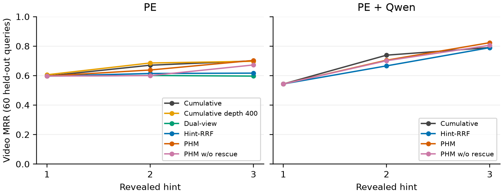
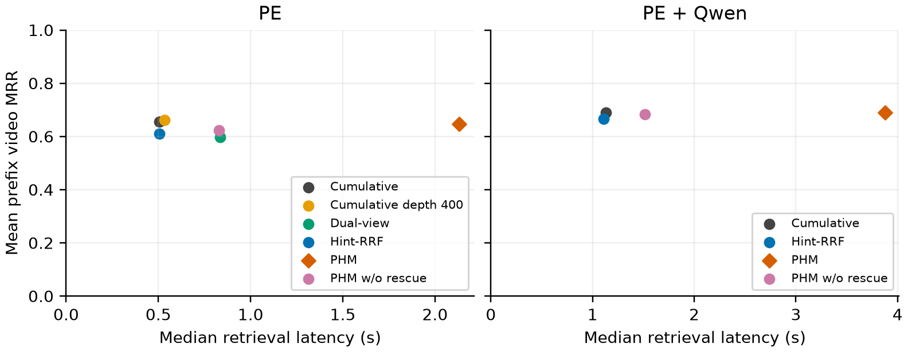

# PHM locked benchmark — 2026-09-21

Code: `b012b9bd40a93faaeb51f9252fc7087ca95a04b9`. This report describes controlled visual PHM evaluation, not the full multimodal AIC2026 system.

75 eligible owner-approved synthetic progressive queries; fixed target-video-group split: 15 development / 60 evaluation. Three prefixes per query. Dataset: InfoShot++ L21–L30, 1,339,055 indexed frames/model; corpus scope is all indexed videos. GT: 90 accepted answer intervals across the approved annotation set; no claim of independently verified continuous playback.

Mean prefix video MRR averages three prefixes within each query before averaging 60 queries. Ranking cap: 250 videos; missing targets score zero. Moment Hit@K tests the first preferred frame of each of the first K displayed video groups against half-open GT intervals, with no search over historical support frames.

Depth selected on dev by latency only: **400**. Latencies were non-monotonic across depth pilots, consistent with uncontrolled live service/cache variation; this limits the strength of the cost-control comparison. PHM reference p50: 2500.4 ms; nearest deep-cumulative absolute gap: 891.9 ms. This is the nearest tested depth, not a claim of equal compute. See `depth-selection.json` and archived dev summaries.

Each evaluation profile was run once after a complete healthy dev run using its exact lock. All translations/parser plans and splits are identical between profiles. No tuning on evaluation. TARA/OCR/ASR/audio/reranker/query expansion disabled.

## Findings and claims supported by this run

All **3,330 prefixes** across the eight runs completed healthy; the two held-out evaluations contain **1,800 prefixes over the same 60 queries / 55 target-video groups**. Audit recomputed metrics from every raw snapshot and checked prefix ledgers, record completeness, configuration and hashes (`audit.json`). Evaluation was executed once per profile.

- **No demonstrated mean-prefix MRR advantage over cumulative.** PHM minus cumulative is −0.0099 for PE and −0.0004 for PE+Qwen; both paired confidence intervals include zero. This is not proof of equivalence.
- **PHM exceeds Hint-RRF on this benchmark:** +0.0367 MRR for PE and +0.0241 for PE+Qwen; the unadjusted paired bootstrap intervals are positive. These multiple comparisons remain exploratory.
- **Rescue contribution is uncertain.** PHM exceeds the no-rescue variant by +0.0229 / +0.0071 MRR, but both intervals include zero. No target was newly recovered from outside the rank cap; rescue worsened target rank in 20 PE prefixes and 10 PE+Qwen prefixes. Recovery counts do not count improvements to already-retrieved targets.
- **Final-turn PE+Qwen Hit@1 is 44/60 for PHM versus 41/60 for cumulative**, a descriptive +5 percentage points. The no-rescue variant also reaches 44/60, so that final-turn gain cannot be attributed to rescue.
- **Cost is substantial:** PHM median latency is 2.13 s vs 0.50 s cumulative for PE, and 3.88 s vs 1.13 s for PE+Qwen. Deeper cumulative is the highest PE mean-prefix MRR (0.6627), with PHM at 0.6459. Do not claim superior efficiency or latency matching.

A defensible paper framing is an implemented, inspectable progressive-retrieval system with an audited evaluation and mixed effectiveness findings. The data does not support claiming that PHM outperforms cumulative retrieval overall or that survivor rescue has a reliably established gain. Further method development needs fresh held-out evaluation; do not tune against these 60 queries and reuse this table as untouched evaluation.

## A — PE controlled experiment

| Method | Mean prefix MRR | H1 Hit@1 | H2 Hit@1 | H3 Hit@1 | H3 Hit@5 | H3 Hit@10 | p50 ms | p95 ms |
|---|---:|---:|---:|---:|---:|---:|---:|---:|
| Cumulative | 0.6558 | 0.483 | 0.583 | 0.617 | 0.800 | 0.867 | 504.5 | 851.3 |
| Hint-RRF | 0.6093 | 0.483 | 0.500 | 0.483 | 0.783 | 0.867 | 506.7 | 836.6 |
| Dual-view | 0.5980 | 0.483 | 0.533 | 0.500 | 0.700 | 0.750 | 836.0 | 983.7 |
| PHM without rescue | 0.6230 | 0.483 | 0.500 | 0.583 | 0.783 | 0.883 | 829.9 | 953.9 |
| PHM | 0.6459 | 0.483 | 0.533 | 0.600 | 0.833 | 0.867 | 2131.2 | 2618.1 |
| Deeper cumulative | 0.6627 | 0.500 | 0.600 | 0.600 | 0.817 | 0.883 | 532.6 | 933.6 |

### Localization, stability and rescue

| Method | H3 Moment H@1/5/10 | First correct H1/H2/H3/unsolved | Stable correct H1/H2/H3/unsolved | Mean top-1 churn | Rescue recovery/harm |
|---|---|---|---|---:|---:|
| Cumulative | 0.400/0.467/0.500 | 29/10/3/18 | 24/10/3/23 | 0.342 | 0/0 |
| Hint-RRF | 0.200/0.267/0.300 | 29/13/1/17 | 13/12/4/31 | 0.500 | 0/0 |
| Dual-view | 0.333/0.400/0.433 | 29/17/3/11 | 10/11/9/30 | 0.675 | 0/0 |
| PHM without rescue | 0.350/0.467/0.533 | 29/13/4/14 | 14/13/8/25 | 0.492 | 0/0 |
| PHM | 0.367/0.483/0.500 | 29/14/2/15 | 15/14/7/24 | 0.458 | 0/20 |
| Deeper cumulative | 0.383/0.483/0.517 | 30/9/3/18 | 25/8/3/24 | 0.342 | 0/0 |

Stable-correct turn is retrospective, not an online stopping policy. Unsolved queries remain explicitly counted. Rescue counts are prefix-level before/after rescue comparisons; recovery means absent-before/present-after within the rank cap, and harm means worse target rank or disappearance.

| Method | Global calls | Local calls | Query vectors | Frames returned | Failure/timeout rate |
|---|---:|---:|---:|---:|---:|
| Cumulative | 180 | 0 | 180 | 36000 | 0.000/0.000 |
| Hint-RRF | 180 | 0 | 180 | 36000 | 0.000/0.000 |
| Dual-view | 300 | 0 | 300 | 60000 | 0.000/0.000 |
| PHM without rescue | 300 | 0 | 300 | 60000 | 0.000/0.000 |
| PHM | 300 | 1569 | 300 | 64707 | 0.000/0.000 |
| Deeper cumulative | 180 | 0 | 180 | 72000 | 0.000/0.000 |

### Paired differences in mean prefix MRR

| Contrast | Delta | 95% group bootstrap CI |
|---|---:|---|
| phm - cumulative | -0.0099 | [-0.0576, +0.0358] |
| phm - hint_rrf | +0.0367 | [+0.0064, +0.0704] |
| phm - phm_no_rescue | +0.0229 | [-0.0026, +0.0527] |
| phm_no_rescue - dual_view | +0.0250 | [-0.0153, +0.0649] |
| phm - cumulative_deep | -0.0168 | [-0.0644, +0.0296] |

10,000 paired bootstrap resamples of target-video connected components, seed 20260921. Intervals are unadjusted for multiple comparisons and describe this small synthetic-query benchmark.

## B — PE + Qwen replication

| Method | Mean prefix MRR | H1 Hit@1 | H2 Hit@1 | H3 Hit@1 | H3 Hit@5 | H3 Hit@10 | p50 ms | p95 ms |
|---|---:|---:|---:|---:|---:|---:|---:|---:|
| Cumulative | 0.6907 | 0.383 | 0.633 | 0.683 | 0.933 | 0.967 | 1133.6 | 1781.0 |
| Hint-RRF | 0.6662 | 0.383 | 0.517 | 0.717 | 0.900 | 0.917 | 1108.6 | 1738.9 |
| PHM without rescue | 0.6832 | 0.383 | 0.567 | 0.733 | 0.900 | 0.933 | 1516.9 | 2821.7 |
| PHM | 0.6903 | 0.383 | 0.567 | 0.733 | 0.933 | 0.967 | 3875.1 | 5891.7 |

### Localization, stability and rescue

| Method | H3 Moment H@1/5/10 | First correct H1/H2/H3/unsolved | Stable correct H1/H2/H3/unsolved | Mean top-1 churn | Rescue recovery/harm |
|---|---|---|---|---:|---:|
| Cumulative | 0.400/0.517/0.550 | 23/16/6/15 | 21/13/7/19 | 0.425 | 0/0 |
| Hint-RRF | 0.283/0.317/0.333 | 23/13/11/13 | 17/11/15/17 | 0.483 | 0/0 |
| PHM without rescue | 0.400/0.500/0.517 | 23/14/9/14 | 19/14/11/16 | 0.433 | 0/0 |
| PHM | 0.400/0.550/0.550 | 23/14/9/14 | 19/14/11/16 | 0.433 | 0/10 |

Stable-correct turn is retrospective, not an online stopping policy. Unsolved queries remain explicitly counted. Rescue counts are prefix-level before/after rescue comparisons; recovery means absent-before/present-after within the rank cap, and harm means worse target rank or disappearance.

| Method | Global calls | Local calls | Query vectors | Frames returned | Failure/timeout rate |
|---|---:|---:|---:|---:|---:|
| Cumulative | 360 | 0 | 360 | 72000 | 0.000/0.000 |
| Hint-RRF | 360 | 0 | 360 | 72000 | 0.000/0.000 |
| PHM without rescue | 600 | 0 | 600 | 120000 | 0.000/0.000 |
| PHM | 600 | 3250 | 600 | 129750 | 0.000/0.000 |

### Paired differences in mean prefix MRR

| Contrast | Delta | 95% group bootstrap CI |
|---|---:|---|
| phm - cumulative | -0.0004 | [-0.0460, +0.0431] |
| phm - hint_rrf | +0.0241 | [+0.0029, +0.0443] |
| phm - phm_no_rescue | +0.0071 | [-0.0023, +0.0190] |

10,000 paired bootstrap resamples of target-video connected components, seed 20260921. Intervals are unadjusted for multiple comparisons and describe this small synthetic-query benchmark.

## Reproducibility and limits

Full raw retrieval traces, runner logs and frozen locks are retained locally under `benchmarks/progressive/runs/paper-20260921/`. The updated six-page paper draft is available as [PDF](paper-draft.pdf). The compact export contains evaluation records, summaries, locks, manifests, depth-selection evidence, CSV and LaTeX tables. `artifact-hashes.json` binds every raw campaign file by SHA-256; raw files must be transferred separately for independent trace replay.

PE checkpoint provenance comes from the embedding-export manifest. The live PE health endpoint reports model identity but does not attest the loaded checkpoint hash. Qwen live health reports the pinned model revision. Post-run checks confirmed unchanged reported model identities/revision and index cardinalities. Remote index cardinalities match manifests; complete remote index bytes were not rehashed. This limitation must remain in any reproducibility claim.

The initial translation-preparation attempt stopped on a provider failure before retrieval began. Preparation was retried with a checkpoint/retry wrapper that preserves successful production-parser outputs verbatim. All benchmark methods subsequently consume the same frozen plans; this operational retry does not change scoring or count as an evaluation run.

Measured latency includes the production engine path with frozen parser plans and its session-local caches, but excludes trace serialization and initial translation preparation. Methods run sequentially in seeded order; live service load can affect latency. The selected deeper cumulative depth may remain far from PHM latency; report that gap rather than calling the runs compute-matched.

No user study, real reveal-time savings, calibrated submission confidence, or generalization to VBS/V3C is established by this experiment.
