# Progressive Hint Memory — triển khai v1

## Trạng thái và cách dùng

Trong console đầy đủ, chọn **T-KIS → Progressive Hint Memory**. Chọn profile BTC hoặc InfoShot++; chọn PE/Qwen khi profile hỗ trợ. Nhập từng hint đã công bố rồi bấm **Áp dụng hint và tìm kiếm**. Chọn `Mô tả tích lũy` nếu mỗi hint mới chứa cả nội dung trước đó. Có thể sửa/tắt một hint rồi áp dụng để replay ledger.

Mỗi tab có session riêng. Thay task, profile, model, dịch query hoặc hybrid tạo session mới. Tắt PHM để quay về truy hồi thông thường. UI PHM hiện khóa `scope=all`, depth 200/model/view; API hỗ trợ scope manual cố định. Chưa bật nhập hint DRES tự động, auto-submit hoặc inspection.

Video card có rank trajectory và tối đa ba frame đại diện/hint. Bấm thời gian trên bằng chứng để chọn **cùng frame** cho Detail, timeline và thao tác nộp hiện có. Frame từ cumulative được ưu tiên trong card; khi không có, card ghi rõ đang dùng bằng chứng cũ. Không coi video đúng là moment đúng. Dấu phân tán dùng khoảng cách 30 giây giữa các bằng chứng chỉ để nhắc operator kiểm tra.

| Module | Implemented | Evaluated | Planned |
| --- | --- | --- | --- |
| Ledger delta/cumulative, dedup, replay khi chỉnh sửa | Có | Unit/integration, mock | Audit hint thật |
| PHM, survivor rescue, newcomer backfill | Có | Invariant tests và PE-only live smoke trên InfoShot++ | Đánh giá hiệu quả trên GT đã duyệt |
| Session API, revision ownership, retry, TTL, event journal | Có | API/concurrency/failure tests | Hạ tầng nhiều process nếu cần |
| UI trajectory, bằng chứng/hint, chọn moment | Có | Vitest + browser mock/live; seek video thật | Operator pilot |
| DRES reveal filtering | Có | Mock transport, clock/restart tests | Đối chiếu bản DRES thi đấu |
| Event replay của snapshot đã commit | Có | Bằng đúng snapshot API trong test | Algorithm replay/benchmark runner riêng |
| GT chuẩn hóa và benchmark | GT được owner chấp nhận: 75 TKIS đủ điều kiện | Validate cấu trúc/provenance; benchmark chưa chạy | Khóa split và chạy protocol |
| V3C/MVK/GynSurg adapter, ingest, coverage | Chưa | Chưa | Giai đoạn sau |
| NVILA inspection theo snapshot, learned confidence | Chưa | Chưa | Giai đoạn sau |

**Benchmark được để lại theo yêu cầu của người dùng.** Hướng dẫn dành cho AI tạo GT có start/end và ba hint từ video: [PHM_GROUND_TRUTH_GUIDE.md](../benchmarks/PHM_GROUND_TRUTH_GUIDE.md). Đợt annotation tiếp theo đã được chủ dữ liệu chấp nhận là GT chuẩn hóa: 77 record approved, 90 answer intervals, 75 query đủ điều kiện benchmark TKIS. Xem [audit hiện hành](../benchmarks/progressive/annotations/audit_report.md) và [owner approval](../benchmarks/progressive/annotations/owner_approval.json). Đây là chấp nhận của chủ dữ liệu, không phải tuyên bố agent đã kiểm chứng playback độc lập. Chưa có kết quả effectiveness hoặc claim cải thiện.

## Thiết kế trong code

```mermaid
flowchart LR
    UI[Operator nhập hint đã công bố] --> API[Progressive session API]
    API --> Ledger[Ledger hiệu lực]
    Ledger --> Global[SearchService: delta + cumulative]
    Global --> Trace[Raw hits theo model/query]
    Memory[Memory video/hint] --> Rescue[Rescue + backfill có budget]
    Trace --> Rescue
    Rescue --> Pool[Raw-score pool trong cùng model/query]
    Pool --> Fusion[RRF rồi video grouping]
    Fusion --> Memory
    Memory --> Rank[PHM score + cumulative]
    Rank --> Commit[Commit nếu còn sở hữu revision]
    Commit --> Cards[Trajectory + evidence + timeline]
    Commit --> Log[JSONL journal]
    Cards --> Operator[Operator chọn moment và dùng submit guard]
```



Các file chính:

- `backend/app/progressive/core.py`: ledger, geometric score, merge local/global, policy giới hạn memory và rescue.
- `backend/app/progressive/engine.py`: điều phối SearchService, cache vectors theo session, evidence/hint và scoring.
- `backend/app/progressive/models.py`: API/config và RetrievalTrace.
- `backend/app/services/progressive_service.py`: lock, revision, idempotency, TTL, journal.
- `backend/app/retrieval_work.py`: counters theo request bằng ContextVar, tránh trộn request đồng thời.
- `frontend/src/components/ProgressivePanel.tsx`: ledger editor, retry và ownership của HTTP result.
- `frontend/src/components/Results.tsx`, `frontend/src/FullConsole.tsx`: trajectory, evidence và selection theo ID.

`/api/search` vẫn giữ response cũ. Interface nội bộ `SearchService.retrieve(..., trace=..., vector_cache=...)` thêm ranked hits trước fusion, raw score, query config, trạng thái channel và latency. `_search_visual_model(..., video_id=..., vector_cache=...)` dùng lại vector cho filtered search.

### Ledger và memory

Chuẩn hóa Unicode NFC và whitespace. Cumulative append theo prefix lấy delta; cumulative thay nội dung cũ trở thành mô tả thay thế, invalidates memory cũ. Exact duplicate không có thêm phiếu. Không fuzzy dedup màu sắc hoặc chi tiết tương tự. Hint `revealed_at` chưa đến thời gian hiệu lực bị lọc **trước parser, encoder và journal retrieval**. `input_ledger` trong event log chỉ gồm input đã release, bao gồm trạng thái enabled/disabled.

Với hạng video 1-based `r`, evidence là `61/(60+r)`. Không xuất hiện trong top-K dùng số 0 trong scoring và giữ nhãn `unobserved`. Channel hỏng ghi `unavailable`; hint có mọi channel hỏng không vào geometric mean. Có ít nhất một channel hợp lệ thì hint vẫn là phép đo hợp lệ, kèm trạng thái degraded nếu có lỗi.

`M = geometric_mean(0.1 + 0.9*e_i)` trên các hint hợp lệ. `S = 0.70*M + 0.30*C`, trong đó C là evidence từ video rank của cumulative hiện tại. Đây là score xếp hạng, **không phải xác suất đúng**. API có preset `phm_no_rescue`, `phm_arithmetic`, `cumulative`, `latest`, `hint_rrf` để chuẩn bị cho ablation; chưa có đánh giá thực nghiệm các preset đó.

Memory ranking tối đa 250 video; bảo vệ top-20 hiện tại và top-20 lượt trước, phần còn lại theo score, tie-break ID. Evidence của video bị evict được loại khỏi memory; nếu video quay lại thì cần backfill để lấy bằng chứng hint cũ. Rank của video còn giữ vẫn là rank trong raw candidate pool, không được nâng lên do eviction. Cache raw request phục vụ replay có vòng đời session và không phải danh sách ứng viên được bảo vệ vĩnh viễn. Mỗi hint có tối đa ba frame đại diện/video, loại frame trùng ID hoặc cách nhau dưới 2 giây. Snapshot cũ không bị sửa khi backfill tìm được bằng chứng cho hint trước; evidence ghi `discovered_at_turn` tại lượt thật sự tìm thấy.

### Rescue và chi phí

Tối đa 8 survivor thiếu evidence delta; tối đa 4 newcomer được backfill hint cũ; tổng 16 cặp `(video,hint)`/turn. Mỗi cặp chạy các visual model đã bật với local top-3. Concurrency local là 4 và timeout từng call là 20 giây. Deadline toàn revision là 180 giây. Query/model encode được cache trong session; dataset/config khác có session khác.

Global và local hits được dedup và sắp bằng raw similarity **chỉ trong cùng model/query/collection**, sau đó tạo candidate-pool ranks và RRF. Local #1 yếu hơn mọi global hit vẫn đứng sau các global hit. Raw cosine PE/Qwen không được cộng hoặc min-max riêng từng video.

`budget` mô tả turn cuối, `revision_budget` cộng tất cả turn thực sự replay trong revision. Revision không đổi ledger có `no_op=true`, revision budget rỗng. Retry cùng request ID trả đúng response cũ và không chạy lại retrieval.

Counters đếm vector được yêu cầu encode, lời gọi retrieval index được dispatch và frame trả về; bao gồm GLAP nếu hybrid gọi nó. Không đếm metadata lookup vào số retrieval index calls. Timeout/abort không chứng minh GPU đã ngừng; counter không phải hóa đơn GPU hay số kernel đã hoàn tất. Không dùng chỉ số mock để kết luận latency live. Khi GLAP lỗi nhưng Elastic audio chạy được, log ghi fallback đó.

## API

```http
POST /api/progressive/sessions
Content-Type: application/json

{
  "retrieval_database": "infoshotpp",
  "task_id": "operator-task-1",
  "image_models": ["pe", "qwen3_vl"],
  "scope": {"mode": "all", "categories": []},
  "top_k": 200,
  "translate": false,
  "hybrid": false,
  "method": "phm"
}
```

Sau khi nhận `session_id`:

```http
PUT /api/progressive/sessions/SESSION_ID/hints
Content-Type: application/json

{
  "expected_revision": 0,
  "client_request_id": "unique-request-1",
  "hints": [
    {"hint_id": "h1", "raw_text": "A person is cooking.", "input_mode": "delta", "enabled": true}
  ]
}
```

Request sau gửi **toàn bộ ledger hiện hành**, không chỉ delta mới, và dùng revision mới nhất đã được server nhận. `revealed_at` trong mỗi hint và `elapsed_ms` trong request là **ms kể từ đầu task**, không phải timestamp wall clock. Operator nhập hint đã công bố có thể để `revealed_at=null`.

- `GET /api/progressive/sessions/{id}`: snapshot đã commit, `revision` đã nhận, `committed_revision`, `pending_revision`, `last_error`.
- `DELETE /api/progressive/sessions/{id}`: đóng session, kết quả đang chạy mất quyền commit.
- `409`: stale expected revision, request ID dùng cho payload khác, hoặc result đã superseded.
- `410`: hết TTL, đã đóng hoặc process/config đã restart; tạo session mới và replay input hiện hành.
- `429`: giới hạn session hoặc 4 revision còn chạy trên cùng session.
- `503`: retrieval thất bại; snapshot đã commit trước đó được giữ nguyên.

Nếu HTTP bị mất kết nối, retry **cùng body và client_request_id**. Để gửi nội dung khác sau một lỗi xác định, GET trạng thái trước. Abort ở browser chỉ dừng chờ HTTP; kết quả cũ không được sửa selection/loading của UI mới. Frontend không dùng localStorage cho session IDs nên các tab không chia sẻ memory.

## Journal, replay và vận hành

Chạy backend **một process/worker**. Không chạy nhiều uvicorn workers sau một load balancer với state này. TTL 60 phút không hoạt động, giới hạn 128 session/process và 32 hint/input ledger. State không được khôi phục ngầm sau restart; JSONL là artifact audit, không phải database session.

Journal: `$AIC26_DATA_DIR/progressive/{session_id}.jsonl` (dùng data directory mặc định của app nếu biến chưa đặt). Các event gồm `created`, `update`, `committed`, `failed`, `superseded`, `closed`. Creation ghi commit code, SHA-256 source backend, tên collection/index, mode mock/live và config. Commit ghi raw per-hint traces, cumulative trace, provenance, ranking và snapshot. Không ghi query vectors hoặc credentials.

`dataset_revision` và `model_revisions` trong config là version **operator cung cấp**, mặc định chưa xác nhận. Tên collection không chứng minh dữ liệu không đổi; worker đang chạy đúng checkpoint nào và corpus manifest còn cần xác minh trước benchmark. Không gán version giả khi worker chưa công bố revision.

Đọc lại các snapshot đã commit, không gọi encoder/index/DRES:

```sh
cd backend
PYTHONPATH=. .venv/bin/python -m app.progressive.replay /path/to/session.jsonl > snapshots.jsonl
```

Đây là **replay event để khôi phục kết quả UI đã ghi nhận**, không phải chạy lại thuật toán từ raw observations hay benchmark công bằng giữa các method. Engine online dùng chung core có thể dùng cho runner sau này, nhưng runner evaluation chưa được triển khai trong scope hiện tại.

Journal không tự xóa theo TTL của memory; lên lịch archive/xóa log theo nhu cầu vận hành. Không công bố journal như dữ liệu mở khi chưa kiểm tra quyền sử dụng query/media.

## DRES reveal

`SubmitService.task_hint()` cache sequence gốc và lọc lại mỗi poll. Chỉ trả hint khi task RUNNING và có elapsed hợp lệ; không biết thời gian thì yêu cầu nhập thủ công. Không trả future text/media ra UI. Theo upstream [ApiContentElement](https://github.com/dres-dev/DRES/blob/master/backend/src/main/kotlin/dev/dres/api/rest/types/task/ApiContentElement.kt), offset là giây; [ApiEvaluationState](https://github.com/dres-dev/DRES/blob/master/backend/src/main/kotlin/dev/dres/api/rest/types/evaluation/ApiEvaluationState.kt) trả elapsed theo giây. Đây là kiểm tra source upstream, chưa xác nhận OpenAPI của server thi đấu live. Không bật DRES submission trong thay đổi này.

## Kiểm thử và giới hạn đã biết

```sh
cd backend
PYTHONPATH=. .venv/bin/python -m pytest -q
```

```sh
cd frontend
npm run test
npm run build
```

Kiểm tra ngày 20/09/2026: backend mock suite pass 460 tests; frontend suite pass 362 tests. Các test PHM kiểm tra ledger/reveal, H1 baseline, raw-score pooling, newcomer/backfill, snapshot immutability, lỗi một/toàn bộ channel, idempotency, TTL, concurrency, cách ly tab, giữ ledger khi chuyển tab, replay event và selection ID. Build TypeScript/Vite pass; còn cảnh báo bundle lớn của Vite và deprecation Starlette/httpx trong test backend.

Browser smoke chạy UI và backend ở **mock mode** qua hai lượt, không thay API bằng response giả trên browser, không có page error; click evidence giữ đúng frame trong Detail. [Ảnh mock](progressive-mock.png) có fixture mock và media chưa tải.

Sau khi người dùng bật backend, kiểm tra thêm **PE-only live trên InfoShot++**, toàn corpus, top-200, hai hint tiếng Anh nhập thủ công, tắt dịch/hybrid. Ở lần smoke có artifact [metadata](progressive-live-smoke.json), H1 mất 646,48 ms, H2 mất 3996,15 ms. H2 encode 2 vector, dispatch 2 global + 12 local index calls, với 8 rescue và 4 backfill đều thành công. Hai lượt không degraded. Đây là thời gian của **một phiên kiểm tra**, không phải p50/p95 hoặc kết quả benchmark; lần smoke trước có thời gian khác (2382,82 / 4465,81 ms).

[Screenshot live](progressive-live-smoke.png) chụp từ UI chạy API live, có keyframe thật. Click evidence chọn `L22/L22_V011/1863`; player load thành công và seek tới **547,8 giây**, khớp timestamp evidence và Detail; không có page error. Event replay từ journal live khớp đúng cả hai snapshot API. Các session smoke được đóng sau kiểm tra và không có submission nào được gửi. Snapshot chỉ minh họa workflow, không chứng minh đáp án của một query GT đã audit.

Health lúc kiểm tra: PE, Elastic và Milvus phản hồi ở BTC/InfoShot++; collection Qwen truy cập được nhưng encoder Qwen unreachable, nên **chưa kiểm chứng PHM PE+Qwen live**. Full corpus coverage/checkpoint identity và độ chính xác truy hồi vẫn cần audit riêng trước benchmark.

Các hạn chế còn lại: metadata/identity vẫn dùng adapter AIC hiện có; Qwen capability còn theo profile InfoShot++; UI PHM chưa có negative feedback/operator rejection riêng; chưa có inspection snapshot ownership; chưa có user study; bộ GT chuẩn hóa đã được owner chấp nhận nhưng chưa có bảng kết quả benchmark. Chỉ mô tả những module này là planned trong paper.
